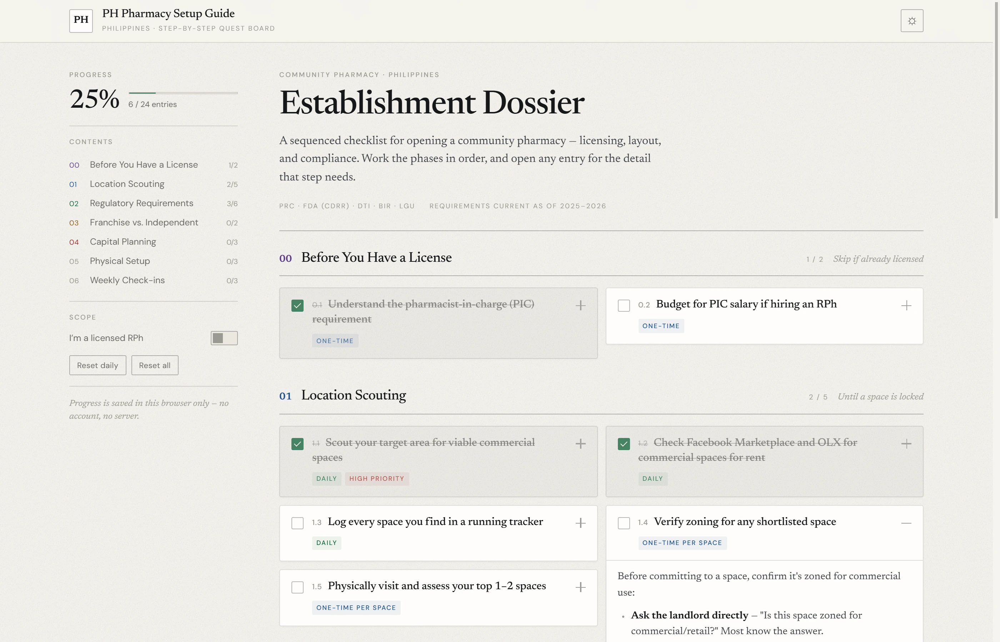
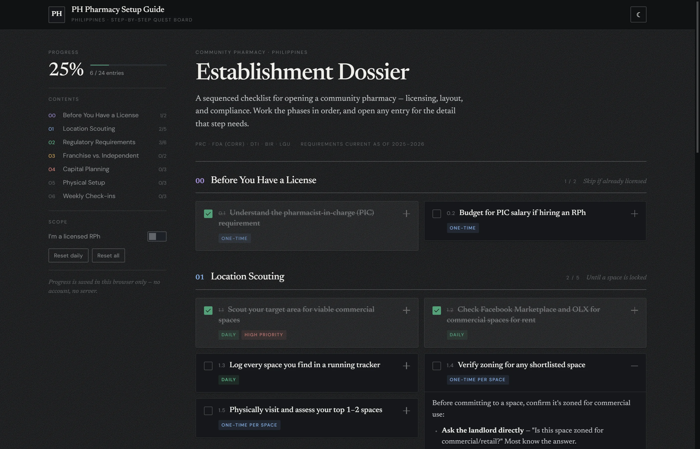
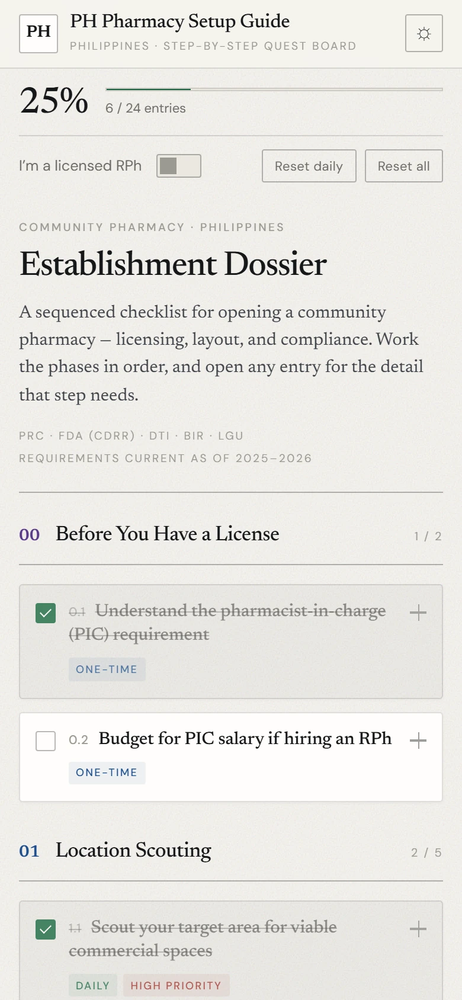

# PH Pharmacy Setup Guide

A single-page checklist for opening a community pharmacy in the Philippines — licensing, layout, capital, and compliance. Built as a quest board: seven phases you work in order, entries you tick off, and progress that stays on your own device.

**[Open the guide →](https://anki-boi.github.io/PH-Pharmacy-Setup-Guide/)**

**→ [Why it exists: the three ways long-horizon setups fail, and what this does about it](PROBLEMS.md)**

## What's inside

Seven phases, 24 entries:

| Phase | Focus |
| --- | --- |
| 00 — Before You Have a License | The PIC requirement, and what an RPh salary does to your working capital |
| 01 — Location Scouting | Demand generators, zoning checks, lease terms, a running space tracker |
| 02 — Regulatory Requirements | FDA LTO, DTI/SEC, Barangay → Mayor's Permit, BIR, master documents |
| 03 — Franchise vs. Independent | TGP / Generika / MedExpress packets, and how to weigh them |
| 04 — Capital Planning | Line-item capital estimate, funding paths, supplier accreditation |
| 05 — Physical Setup | FDA-compliant layout, launch inventory, POS and required records |
| Ongoing — Weekly Check-ins | Tracker review, regulatory updates, permit follow-ups |

Each entry expands into the detail for that step: floor-area minimums, document lists, fee and capital ranges, and the mistakes that stall a launch.

## Features

- **One file, no build.** Plain HTML/CSS/JS. Open `index.html` and it runs; there is nothing to install.
- **Progress stays local.** Ticked entries, expanded panels and the theme are saved to `localStorage` on your device. No account, no server, no analytics.
- **"I'm a licensed RPh" toggle** hides the pre-license phase for anyone already registered.
- **Tags and resets** — daily, one-time, weekly and high-priority entries, with a reset for the daily set or everything.
- **Light and dark theme**, keyboard operable (tab, Space, Enter), responsive from 320px up.
- **Prints as a document.** `Ctrl/Cmd-P` gives the whole guide in strict reading order with every entry expanded.

## Caveats

Fees, salaries and requirements reflect 2025–2026. Confirm against the live FDA (CDRR) checklist and your own LGU before acting on anything here — these change without much notice. Written from a pharmacy-operations perspective, not as legal advice.
